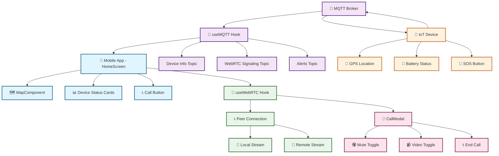
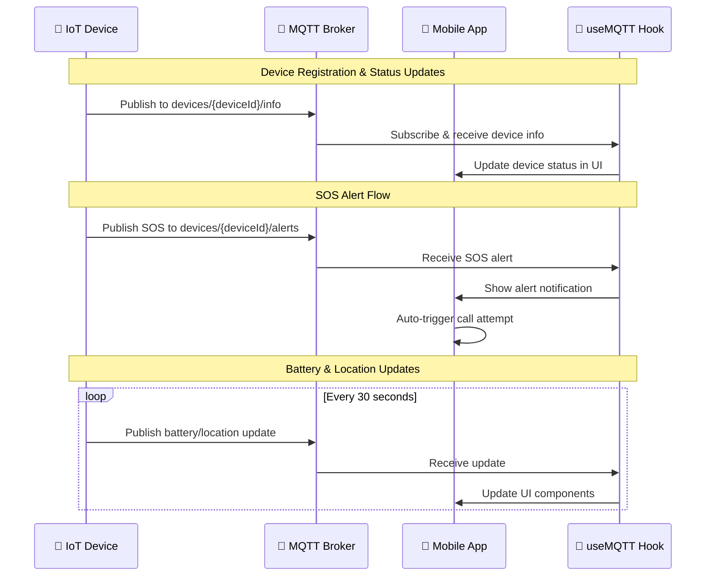
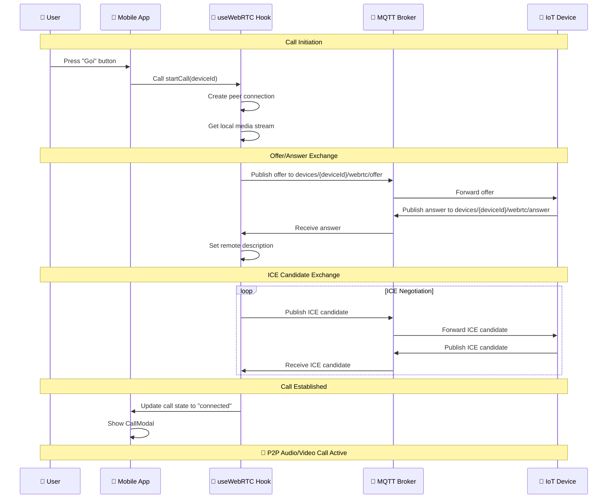
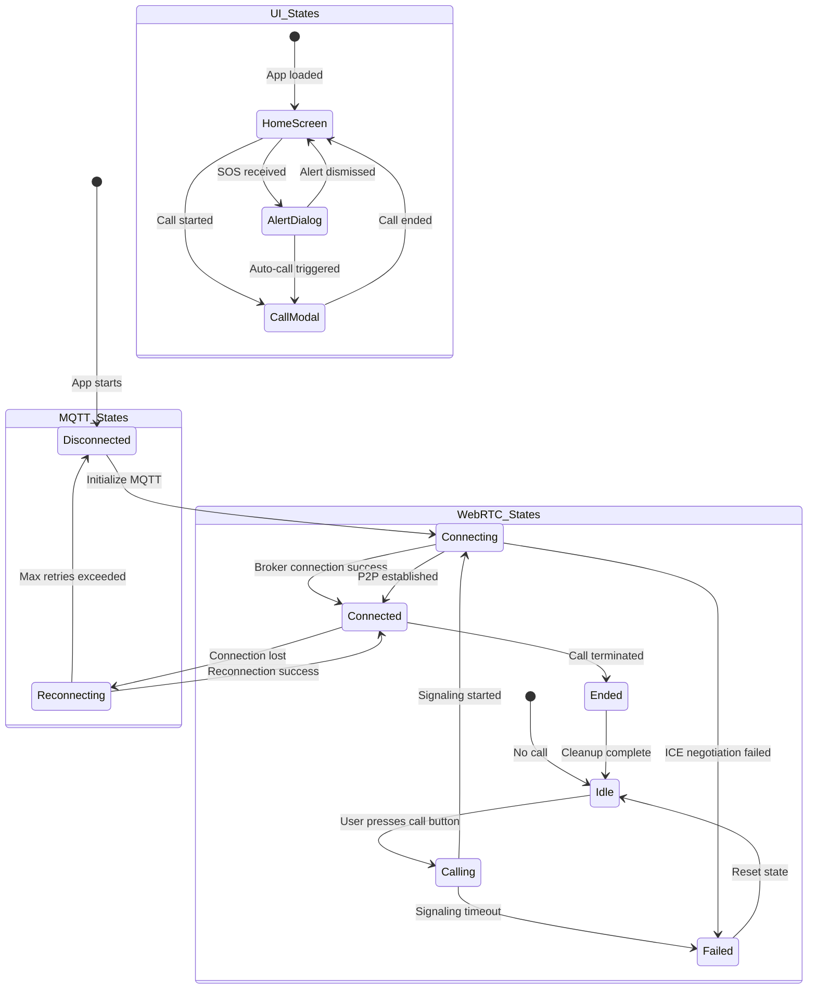
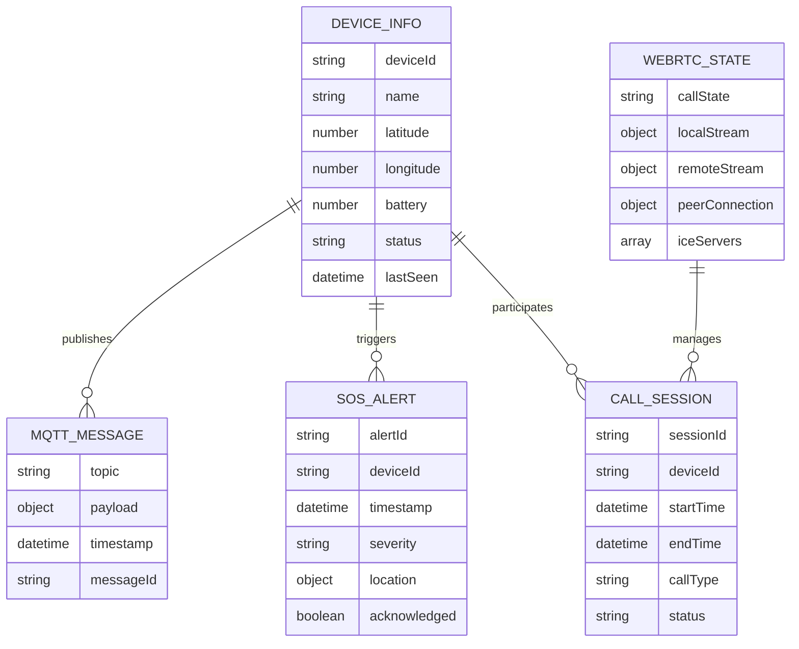
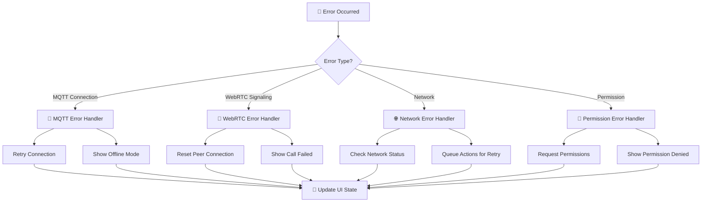

# PBL6 Mobile - System Architecture Flow

## Overall System Flow



## MQTT Communication Flow



## WebRTC Call Establishment Flow



## Component Architecture Flow

```mermaid
graph LR
    %% App Layer
    A[📱 App/_layout.tsx] --> B[📱 (tabs)/_layout.tsx]
    B --> C[🏠 HomeScreen.tsx]
    
    %% Hooks Layer
    C --> D[📡 useMQTT Hook]
    C --> E[🎤 useWebRTC Hook]
    
    %% Components Layer
    C --> F[🗺️ MapComponent]
    C --> G[📱 CallModal]
    
    %% Platform Specific
    F --> H[🗺️ MapComponent.tsx - Web]
    F --> I[🗺️ MapComponent.native.tsx - Mobile]
    
    %% External Services
    D --> J[🔗 MQTT Broker]
    E --> K[🌐 WebRTC Signaling]
    
    %% Data Flow
    J --> L[📊 Device Data]
    K --> M[🎵 Media Streams]
    
    L --> C
    M --> G
    
    %% Styling
    classDef app fill:#e3f2fd,stroke:#0277bd,stroke-width:2px
    classDef hooks fill:#f1f8e9,stroke:#33691e,stroke-width:2px
    classDef components fill:#fef7ff,stroke:#4a148c,stroke-width:2px
    classDef external fill:#fff8e1,stroke:#f57c00,stroke-width:2px
    
    class A,B,C app
    class D,E hooks
    class F,G,H,I components
    class J,K,L,M external
```

## State Management Flow



## Data Structure Flow



## Error Handling Flow


