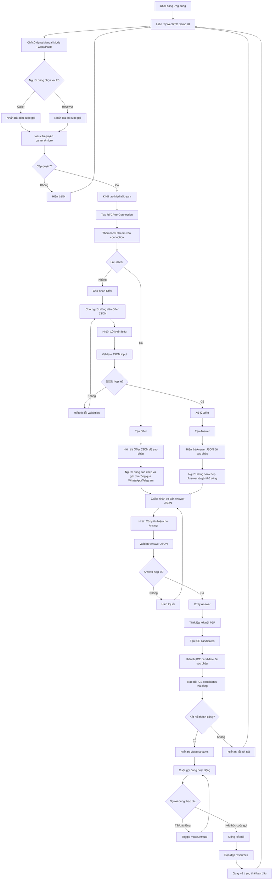
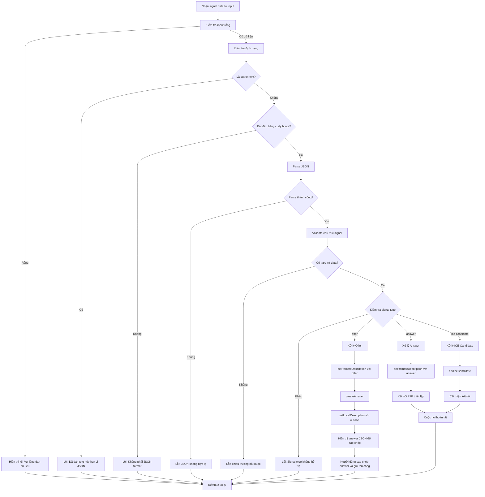
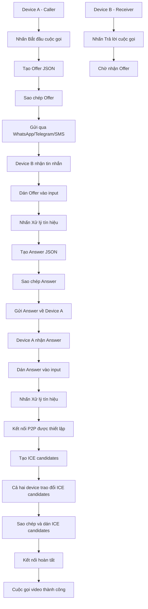
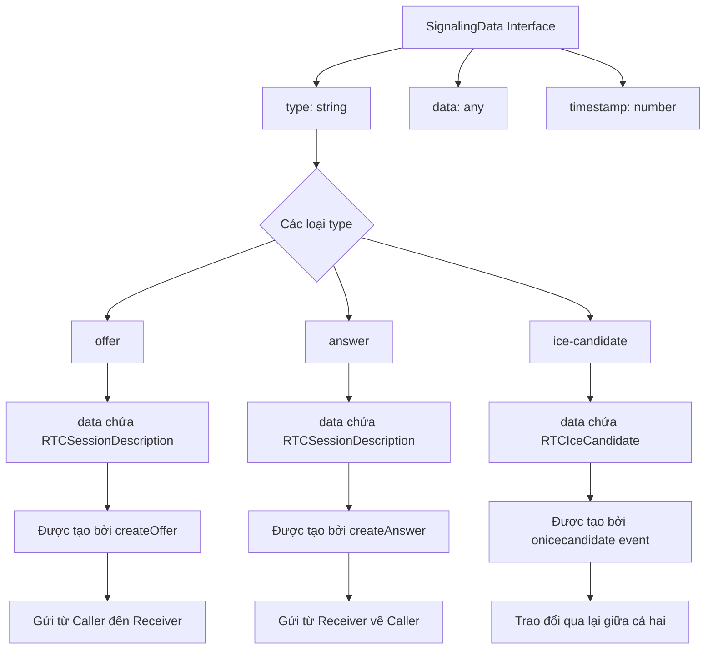

# WebRTC Demo Flowchart - Phiên bản đơn giản (Manual Only)

## Luồng hoạt động chính của WebRTC Demo đơn giản

## Luồng xử lý tín hiệu WebRTC đơn giản (Manual Only)

## Quy trình Manual Signaling đơn giản

## Cấu trúc dữ liệu SignalingData

