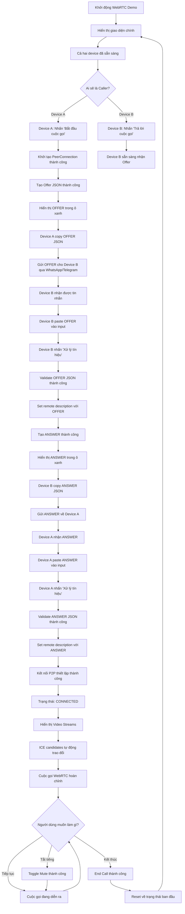
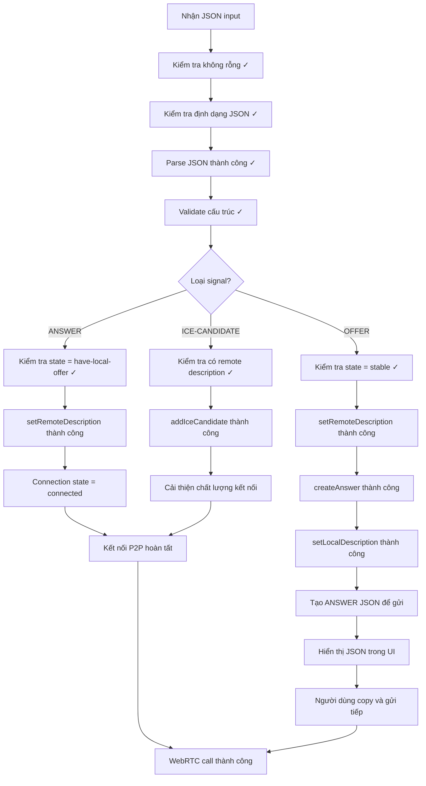
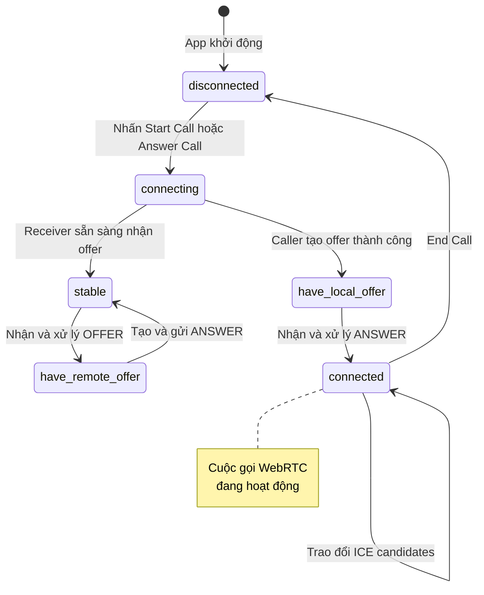
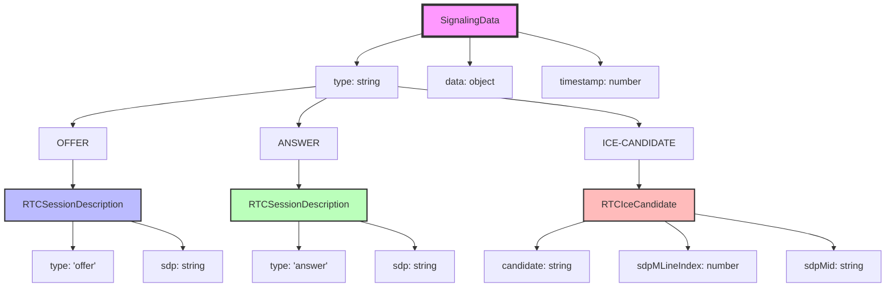

# WebRTC Demo - Happy Case Flowchart

## Luồng thành công hoàn chỉnh của WebRTC Demo



## Quy trình trao đổi JSON (Happy Case)

```mermaid
flowchart LR
    A[Device A - Caller] --> B[Nhấn 'Bắt đầu cuộc gọi']
    B --> C[OFFER JSON xuất hiện]
    C --> D[Copy OFFER]
    D --> E[Gửi qua WhatsApp]
    
    F[Device B - Receiver] --> G[Nhấn 'Trả lời cuộc gọi']
    G --> H[Sẵn sàng nhận OFFER]
    
    E --> I[Device B nhận tin nhắn]
    I --> J[Paste OFFER vào input]
    J --> K[Nhấn 'Xử lý tín hiệu']
    K --> L[ANSWER JSON xuất hiện]
    L --> M[Copy ANSWER]
    M --> N[Gửi ANSWER về Device A]
    
    N --> O[Device A paste ANSWER]
    O --> P[Nhấn 'Xử lý tín hiệu']
    P --> Q[Kết nối thành công!]
    
    style A fill:#e1f5fe
    style F fill:#e8f5e8
    style Q fill:#fff3e0
```



## Chi tiết xử lý tín hiệu thành công



## Timeline thành công của WebRTC Demo

```mermaid
gantt
    title WebRTC Demo - Happy Case Timeline
    dateFormat X
    axisFormat %M:%S
    
    section Device A (Caller)
    Nhấn Start Call          :0, 10s
    Tạo OFFER               :10s, 15s
    Copy và gửi OFFER       :15s, 30s
    Nhận ANSWER             :60s, 70s
    Paste ANSWER            :70s, 80s
    Kết nối thành công      :80s, 85s
    
    section Device B (Receiver)
    Nhấn Answer Call        :20s, 25s
    Nhận OFFER              :30s, 40s
    Paste OFFER             :40s, 50s
    Tạo ANSWER              :50s, 60s
    Copy và gửi ANSWER      :60s, 70s
    
    section WebRTC Connection
    P2P Connection          :80s, 90s
    Video Call Active       :90s, 120s
```

## Trạng thái kết nối WebRTC



## Cấu trúc dữ liệu JSON trong Happy Case



## Happy Case - Các bước thành công

### Bước 1: Khởi tạo thành công
- ✅ App khởi động không lỗi
- ✅ UI hiển thị đầy đủ
- ✅ Instructions rõ ràng

### Bước 2: Caller thành công
- ✅ Nhấn "Bắt đầu cuộc gọi"
- ✅ PeerConnection khởi tạo thành công  
- ✅ OFFER JSON hiển thị trong ô xanh
- ✅ Copy OFFER thành công

### Bước 3: Receiver thành công
- ✅ Nhấn "Trả lời cuộc gọi"
- ✅ Paste OFFER vào input
- ✅ Validate JSON thành công
- ✅ ANSWER JSON hiển thị trong ô xanh
- ✅ Copy ANSWER thành công

### Bước 4: Kết nối thành công
- ✅ Caller paste ANSWER
- ✅ setRemoteDescription thành công
- ✅ Connection state = "connected"
- ✅ Video streams hiển thị
- ✅ ICE candidates trao đổi thành công

### Bước 5: Cuộc gọi hoạt động
- ✅ Audio/Video hoạt động
- ✅ Mute/Unmute thành công
- ✅ End call thành công
- ✅ Reset về trạng thái ban đầu